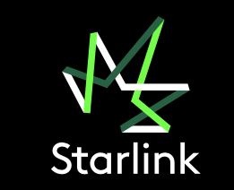

# Starlink
## О приложении
Telegram-бот предназначен для поддержки новых сотрудников и кандидатов. Он отвечает на часто задаваемые вопросы, помогает с адаптацией и обеспечивает плавный переход в компанию.

Сотрудники могут проходить разнообразные квизы и опросы прямо в боте. Подтверждение занятости в компании осуществляется HR-специалистом через специальное веб-приложение.  <!-- описание репозитория -->




## Для канидатов
С помощью бота кандидаты могут ознакомиться с информацией о компании, изучить её историю, а также подать заявку на вступление в команду.

## Для сотрудников
После успешной регистрации и подтверждения HR-ом новые сотрудники получают доступ к полезной информации и могут участвовать в разнообразных опросах и квизах.

## Для компании
Пополнение информацией осуществляется сотрудниками компании, имеющими доступ к специальному веб-приложению. В этом приложении предусмотрен удобный интерфейс для добавления данных в бот, а также для формирования списка часто задаваемых вопросов.
<!--Установка-->

# Используемые технологии
Используемые технологии
- Python 3.12
- Alembic 1.14.0
- SQLalchemy 12.0.36
- Postgres 17.1
- FastAPI 0.115.5
- FastAPI Users 14.0.0
- PyTelegramBotAPI 4.24.0
- Jinja2 3.1.4
## Установка 
1. Клонирование репозитория 

```git clone https://github.com/Studio-Yandex-Practicum/Starlink_team2```

2. Создание .env файла.
   ```
   BOT_TOKEN = <TOKEN>
   APP_TITLE = 'Административная панель Starlink бот'
   APP_DESCRIPTION = 'Управление справочным чат ботом для сотрудников'
   APP_VERSION='1.0.0'
   POSTGRES_USER = 'user'
   POSTGRES_PASSWORD = 'password'
   POSTGRES_HOST = '127.0.0.1'
   POSTGRES_PORT = '5432'
   POSTGRES_DB = <database>
   POSTGRES_DB_NAME=yourdbname
   SECRET_KEY="your-secret-key"
   ALGORITHM="HS256"
   ACCESS_TOKEN_EXPIRE_MINUTES=30
   NOT_AUTHENTICATED = "Not authenticated"
   ADMIN1_EMAIL=user1@gmail.com
   ADMIN1_PASSWORD=12345
   ADMIN2_EMAIL=user2@gmail.com
   ADMIN2_PASSWORD=54321
   ```
3. Для локального запуска всего проекта в контейнере использовать:
```bash
sudo docker compose -f docker-compose.local.yml up --build
```
В .env файле нужно указать:
```bash
# для работы в контенере указать имя контенера с базой: postgres
POSTGRES_HOST = postgres
```

   
## Документация используемых библиотек
- [Alembic 1.14.0](https://alembic.sqlalchemy.org/en/latest/index.html)
- [SQLalchemy 12.0.36](https://docs.sqlalchemy.org/en/20)
- [Postgres 17.1](https://www.postgresql.org/docs/17/index.html)
- [FastAPI 0.115.5](https://fastapi.tiangolo.com/)
- [FastAPI Users 14.0.0](https://fastapi-users.github.io/fastapi-users/latest/)
- [PyTelegramBotAPI 4.24.0](https://pytba.readthedocs.io/en/latest/index.html)
- [Jinja2 3.1.4](https://jinja.palletsprojects.com/en/stable/templates/)

[Релизы программы]: https://github.com/OkulusDev/Oxygen/releases

<!--Поддержка-->
## Команда проекта
[Валерий  (тимлид команды)](https://github.com/gugutsidze-vv)\
[Николай	Клепов](https://github.com/flyde2)\
[Андрей	Дмитриев](https://github.com/dmi3ev1987)\
[Кирилл	Кузнецов](https://github.com/Kirill-kuz)\
[Эдуард	Власов](https://www.github.com/QuickLike)\
[Владимир	Молчанов](https://github.com/r1kenpy)\
[Иван	Войцик](https://github.com/Oktopus90)

## Различные функции
После запуска проекта у вас будет достпна административная панель бота и сам телеграм бот
### Админка
При создании админки добавлются пользователи 
```
   ADMIN1_EMAIL=user1@gmail.com
   ADMIN1_PASSWORD=12345
   ADMIN2_EMAIL=user2@gmail.com
   ADMIN2_PASSWORD=54321
```
После авторизации пользователи могут получить доступ к административной панели проекта. Здесь можно добавлять данные в базу данных.
Административная панель позволяет загружать рабочие электронные адреса для проверки того, работает ли сотрудник в компании или нет.
Также в админке можно добавлять различные кнопки и элементы меню для Telegram-бота, а также создавать информационные сообщения.

### Телеграм бот
При запуске бота командой ```/start``` пользователь автоматически добавляется в базу данных. Для каждого пользователя устанавливается определенный уровень доступа к информации внутри бота.
В боте реализована динамическая генерация inline- и reply-клавиатур на основе данных из базы данных. Клавиатура поддерживает пагинацию, отображая по 10 кнопок на одной странице. У каждой кнопки предусмотрен свой уровень доступа. Все данные, доступные в боте, заполняются сотрудником компании.
