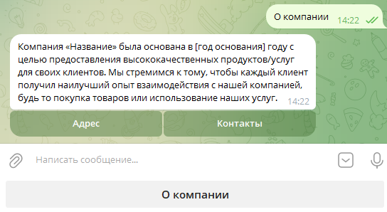

# Starlink
## О приложении
Telegram-бот предназначен для поддержки новых сотрудников и кандидатов. Он отвечает на часто задаваемые вопросы, помогает с адаптацией и обеспечивает плавный переход в компанию.

Сотрудники могут проходить разнообразные квизы и опросы прямо в боте. Подтверждение занятости в компании осуществляется HR-специалистом через специальное веб-приложение.  <!-- описание репозитория -->


## Для канидатов
С помощью бота кандидаты могут ознакомиться с информацией о компании, изучить её историю, а также подать заявку на вступление в команду.

## Для сотрудников
После успешной регистрации и подтверждения HR-ом новые сотрудники получают доступ к полезной информации и могут участвовать в разнообразных опросах и квизах.

## Для компании
Пополнение информацией осуществляется сотрудниками компании, имеющими доступ к специальному веб-приложению. В этом приложении предусмотрен удобный интерфейс для добавления данных в бот, а также для формирования списка часто задаваемых вопросов.
<!--Установка-->

# Используемые технологии
Используемые технологии
- Python 3.12
- Alembic 1.14.0
- SQLalchemy 12.0.36
- Postgres 17.1
- FastAPI 0.115.5
- FastAPI Users 14.0.0
- PyTelegramBotAPI 4.24.0
- Jinja2 3.1.4
## Локальная установка 
1. Клонирование репозитория 

```git clone https://github.com/Studio-Yandex-Practicum/Starlink_team2```

2. Создание .env файла.
   ```
   BOT_TOKEN = <TOKEN>
   APP_TITLE = 'Административная панель Starlink бот'
   APP_DESCRIPTION = 'Управление справочным чат ботом для сотрудников'
   APP_VERSION = '1.0.0'
   POSTGRES_USER = 'user'
   POSTGRES_PASSWORD = 'password'
   POSTGRES_HOST = '127.0.0.1'
   POSTGRES_PORT = '5432'
   POSTGRES_DB = <database>
   POSTGRES_DB_NAME=yourdbname
   SECRET_KEY="your-secret-key"
   ALGORITHM="HS256"
   ACCESS_TOKEN_EXPIRE_MINUTES=30
   NOT_AUTHENTICATED = "Not authenticated"
   ADMIN1_EMAIL=user1@gmail.com
   ADMIN1_PASSWORD=12345
   ADMIN2_EMAIL=user2@gmail.com
   ADMIN2_PASSWORD=54321
   ```
3. Для локального запуска всего проекта в контейнере использовать:
```bash
sudo docker compose -f docker-compose.local.yml up --build
```
В .env файле нужно указать:
```bash
# для работы в контенере указать имя контенера с базой: postgres
POSTGRES_HOST = postgres
```
## Установка на сервере

Для деплоя проекта на сервер в репозиторий на GitHub необходимо добавить 
```
APP_TITLE - Устанавливает название приложения.
APP_DESCRIPTION - Описывает функционал или роль приложения.
APP_VERSION - Указывает текущую версию приложения.
DOCKER_USERNAME - Имя аккауна dockerHub
DOCKER_PASSWORD - Пароль от аккауна dockerHub
SERVER_HOST - Адрес сервера, где будет разворачиваться проект
SERVER_USERNAME - User yf cthdtht
SSH_PRIVATE_KEY - SSH ключ для достпа на сервер
SSH_PASSPHRASE - Пароль от SSH ключа
BOT_TOKEN - Токен для Telegram бота
POSTGRES_USER - Имя пользователя для подключения к базе данных PostgreSQL.
POSTGRES_HOST - Адрес хоста базы данных PostgreSQL (по умолчанию в приложениее - "postgres")
POSTGRES_PORT - Порт для подключения к базе данных 
POSTGRES_PASSWORD - Пароль от Базы данных
POSTGRES_DB - Имя Базы данных.
SECRET_KEY - Секретный ключ для авторизации на сайте
ADMIN1_EMAIL - Адрес электронной почты первого администратора user1@gmail.com
ADMIN1_PASSWORD - Пароль для первого администратора с логином: user1@gmail.com
ADMIN2_EMAIL - Адрес электронной почты второго администратора user2@gmail.com
ADMIN2_PASSWORD - Пароль для первого администратора с логином: user2@gmail.com
NOT_AUTHENTICATED - Сообщение, которое будет выводиться при попытке неавторизованного доступа к определенным ресурсам.
ACCESS_TOKEN_EXPIRE_MINUTES - Определяет срок действия токена доступа в минутах. (по умолчанию в приложениее - "30")
ALGORITHM - Указывает алгоритм шифрования для токенов аутентификации. (по умолчанию в приложениее - "HS256")
```

Далее необходимо произвести обновление проекта в ветку "develop".

## Документация используемых библиотек
- [Alembic 1.14.0](https://alembic.sqlalchemy.org/en/latest/index.html)
- [SQLalchemy 12.0.36](https://docs.sqlalchemy.org/en/20)
- [Postgres 17.1](https://www.postgresql.org/docs/17/index.html)
- [FastAPI 0.115.5](https://fastapi.tiangolo.com/)
- [FastAPI Users 14.0.0](https://fastapi-users.github.io/fastapi-users/latest/)
- [PyTelegramBotAPI 4.24.0](https://pytba.readthedocs.io/en/latest/index.html)
- [Jinja2 3.1.4](https://jinja.palletsprojects.com/en/stable/templates/)

[Релизы программы]: https://github.com/OkulusDev/Oxygen/releases

<!--Поддержка-->
## Команда проекта
[Валерий  (тимлид команды)](https://github.com/gugutsidze-vv)\
[Николай	Клепов](https://github.com/flyde2)\
[Андрей	Дмитриев](https://github.com/dmi3ev1987)\
[Кирилл	Кузнецов](https://github.com/Kirill-kuz)\
[Эдуард	Власов](https://www.github.com/QuickLike)\
[Владимир	Молчанов](https://github.com/r1kenpy)\
[Иван	Войцик](https://github.com/Oktopus90)

## Различные функции
После запуска проекта у вас будет достпна административная панель бота и сам телеграм бот
### Админка
При создании админки добавлются пользователи.
```
   ADMIN1_EMAIL=user1@gmail.com
   ADMIN1_PASSWORD=12345
   ADMIN2_EMAIL=user2@gmail.com
   ADMIN2_PASSWORD=54321
```
После авторизации пользователи могут получить доступ к административной панели проекта. 

На данной странице есть удобная навигационная панель в левой части экрана.
- Главная
- Загрузка электронных адресов
- Квизы
- Построитель меню
- Пользователи
- Роли

В цетнральной и правой части экрана располагается статистка по пользователям в приложении. А также собрана вся информация по приложению: Список ролей, последние добавленные пользователи, сколько пользователей зарегестрировалось по дням.

#### Загрузка электронных адресов
На странице «Загрузка электронных адресов» администратор может загрузить список почтовых адресов сотрудников компании, по которым будет проводиться проверка.
#### Квизы
В разработке.
#### Построитель меню

На этой странице отображены все кнопки меню, имеющиеся в боте. Здесь можно увидеть, какие существуют кнопки, каковы их названия и какая информация будет отображена пользователю после нажатия на каждую из этих кнопок. Также можно посмотреть, для каких пользователей они доступны. На этой странице можно удалять кнопки, открывать их для редактирования или создавать новые кнопки.
##### Редактирование кнопок

Поле «Название» — это название кнопки, тот текст, который будет написан на ней. \
«Родитель» — если кнопка является элементом вложенного меню, здесь указывается меню более высокого уровня. \
Флажок «Является папкой» указывает, станет ли кнопка родительским меню. \
«Картинка» — изображение, которое будет отправлено пользователю при нажатии на эту кнопку. \
«Роли» — указываются те роли, для которых данная кнопка будет доступна. \
Опция «Доступна гостям» показывает, будет ли эта кнопка видима незарегистрированным пользователям. \
«Описание» — текст, который будет отправлен пользователю при нажатии на кнопку.
#### Пользователи

Здесь отображаются все пользователи, запустившие бот, с указанием их имени и фамилии. Можно открыть карточку пользователя для редактирования и назначить ему роль и рабочий электронный адрес.

#### Роли

На этой странице отображается список ролей, а также можно добавлять или удалять роли.

### Телеграм бот
При запуске бота командой ```/start``` пользователь автоматически добавляется в базу данных. 

Когда пользователь нажимает на кнопку "Зарегистрироваться", появляется сообщение с запросом ввести рабочую электронную почту. Затем система проводит проверку введенной электронной почты на наличие в базе данных рабочих электронных адресов.
Если введенная электронная почта отсутствует в базе данных, пользователь имеет возможность продолжать работу с ботом в качестве гостя.
В случае успешной регистрации и проверки почты, для пользователя открывается меню Reply (набор кнопок настраивается администратором системы через административную панель), соответствующее его уровню доступа. Уровень доступа также устанавливается администратором через административную панель.

По нажатию на кнопку отправляется информация, и открывается inline-клавиатура, в которой кнопки отображаются согласно уровню пользователя.

По нажатию на каждую кнопку пользователю отправляется информационное сообщение, которое может содержать текст и картинку.
